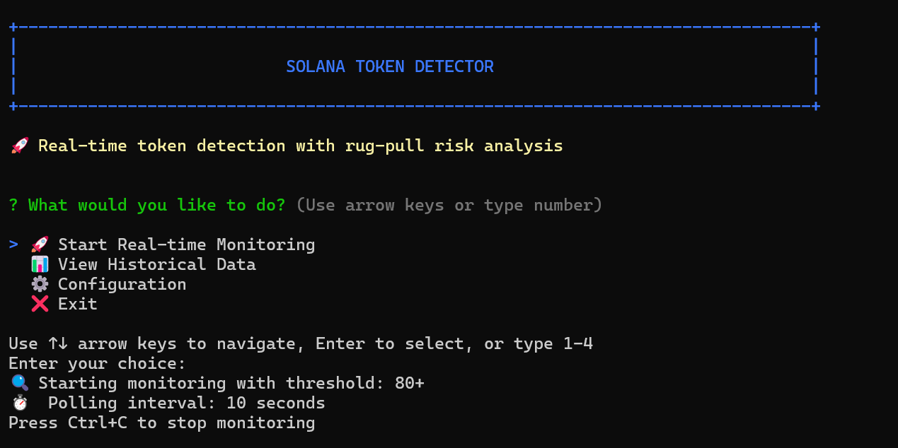

# Solana Token RugCheck Detector

A real-time Solana SPL token monitoring tool that detects newly minted tokens and performs risk analysis using RugCheck's API. The bot automatically saves safe tokens to a local database and provides detailed risk assessments.

**GitHub Repository**: [https://github.com/Dairus01/solana-rugcheck-detector.git](https://github.com/Dairus01/solana-rugcheck-detector.git)

##  Features

- **Real-time Token Detection**: Monitors Solana blockchain for new token mints every 10-300 seconds
- **Risk Analysis**: Integrates with RugCheck API for comprehensive token safety scoring
- **Configurable Thresholds**: Adjustable risk thresholds (default: 81+ for safe classification)
- **Interactive Terminal Interface**: Menu-driven navigation with arrow key support
- **Historical Data Storage**: Automatically saves safe tokens to `safe_to_buy.json`
- **Risk Classification**: Categorizes tokens as LOW (Safe), MEDIUM (Warning), or HIGH (Danger)
- **Detailed Reports**: Shows token metadata, safety scores, and specific risk factors

##  Prerequisites

Before using this tool, you must have:

- **Python** installed (recommended version: 3.8 or higher)
- **pip** for package management
- **Internet connection** for RugCheck API access
- **Terminal** with ANSI color support

## Installation

Follow these steps to set up the Solana Token Detector project on your local machine:

### 1. Clone the Repository

```bash
git clone https://github.com/Dairus01/solana-rugcheck-detector.git
cd solana-rugcheck-detector
```

### 2. Install Dependencies

```bash
pip install -r requirements.txt
```

### 3. Run the Project

```bash
python solana_token_detector.py
```

## Interface Preview

When you start the bot, you'll see this clean, interactive interface:



The interface features:
- **Blue header box** with "SOLANA TOKEN DETECTOR" title
- **Interactive menu** with arrow key navigation
- **Current configuration** display (threshold and polling interval)
- **Clear instructions** for navigation and operation

##  Usage

### Main Menu Options

1. **🚀 Start Real-time Monitoring**
   - Begins live token detection
   - Uses configured risk threshold
   - Automatically saves safe tokens
   - Press Ctrl+C to stop

2. **📊 View Historical Data**
   - Browse all stored safe tokens
   - View detection timestamps and risk factors
   - Access token metadata and creator information

3. **⚙️ Configuration**
   - View current settings
   - Edit risk thresholds and timing
   - Customize API timeouts

4. **❌ Exit**
   - Gracefully close the application

### Navigation

- **Arrow Keys**: ↑↓ to navigate menu options
- **Enter**: Select highlighted option
- **Numbers**: Type 1-4 for direct selection
- **Ctrl+C**: Stop monitoring and return to menu

## ⚙️ Configuration

### Default Settings

```json
{
  "score_threshold": 81,
  "polling_interval": 30,
  "api_timeout": 30
}
```

### Risk Classification

- **LOW (Safe)**: Score > threshold → Saved to `safe_to_buy.json`
- **MEDIUM (Warning)**: 50 ≤ Score ≤ threshold → Displayed only
- **HIGH (Danger)**: Score < 50 → Displayed only

### Customization

- **Score Threshold**: 1-100 (higher = stricter filtering)
- **Polling Interval**: 5-300 seconds between API calls
- **API Timeout**: 10-120 seconds for request timeouts

## 📊 Sample Output

When a new token is detected, the bot displays a comprehensive report:

```
================================================================================
🚀 NEW TOKEN DETECTED!
================================================================================

📋 TOKEN INFORMATION:
✅ Token Name: DEEP
✅ Token Symbol: DEEP
✅ Token Mint: DEQdsdsccEgxKS3TxbLLaNrFoREsdsbqKg1yfiZzRM4E
👤 Creator Wallet: 79XESipcQMDbE1XFrNH6bBj1axbDoVsDgWdXCSRWBLyD
🕒 Detection Time: 2025-08-17 23:46:05 UTC+01:00

📊 RUGCHECK ANALYSIS:
- Safety Score: 63/100
- Risk Level: MEDIUM
- Recommendation: CAUTION_ADVISED
- Risk Reasons:
    • Top 10 holders high ownership (danger) - The top 10 users hold more than 70% token supply
    • Single holder ownership (danger) - One user holds a large amount of the token supply
    • Low Liquidity (danger) - Low amount of liquidity in the token pool
    • High ownership (danger) - The top users hold more than 80% token supply
    • Low amount of LP Providers (warn) - Only a few users are providing liquidity
```

### Debug Information

The bot also shows real-time processing details:

```
🔍 DEBUG: Token Atlantis - Score: 1, Threshold: 80, Risk: HIGH
❌ NOT SAVING: Token Atlantis with score 1 (risk: HIGH)
```

##  File Structure

- `solana_token_detector.py` - Main application
- `config.json` - Configuration settings (auto-generated)
- `safe_to_buy.json` - Database of safe tokens
- `requirements.txt` - Python dependencies


##  Use Cases

- **Token Research**: Discover new Solana tokens as they're minted
- **Risk Assessment**: Evaluate token safety before investment decisions
- **Market Monitoring**: Track token deployment patterns and trends
- **Due Diligence**: Analyze creator history and token economics
- **Portfolio Management**: Identify potentially safe investment opportunities

##  Important Notes

- **Educational Purpose Only**: Not financial advice
- **API Limits**: Respect RugCheck's rate limits
- **Risk Assessment**: Always conduct additional research
- **Data Persistence**: Tokens stored locally in JSON format
- **Real-time Updates**: Continuous monitoring until manually stopped

##  Troubleshooting

- **Import Errors**: Ensure all dependencies are installed
- **API Failures**: Check internet connection and RugCheck status
- **Display Issues**: Verify terminal supports ANSI colors
- **Configuration**: Reset config.json if settings become corrupted

## 📝 License

This project is provided for educational purposes only. Use at your own risk.

## 🤝 Contributing

Contributions are welcome! If you find a bug or have a feature request, please:

1. **Fork** the repository
2. **Create** a feature branch (`git checkout -b feature/amazing-feature`)
3. **Commit** your changes (`git commit -m 'Add some amazing feature'`)
4. **Push** to the branch (`git push origin feature/amazing-feature`)
5. **Open** a Pull Request

## 📊 Repository Stats

- **GitHub**: [https://github.com/Dairus01/solana-rugcheck-detector.git](https://github.com/Dairus01/solana-rugcheck-detector.git)
- **Language**: Python
- **License**: Educational Use
- **Status**: Active Development

## ⭐ Star the Repository

If you find this tool useful, please consider giving it a ⭐ star on GitHub!
